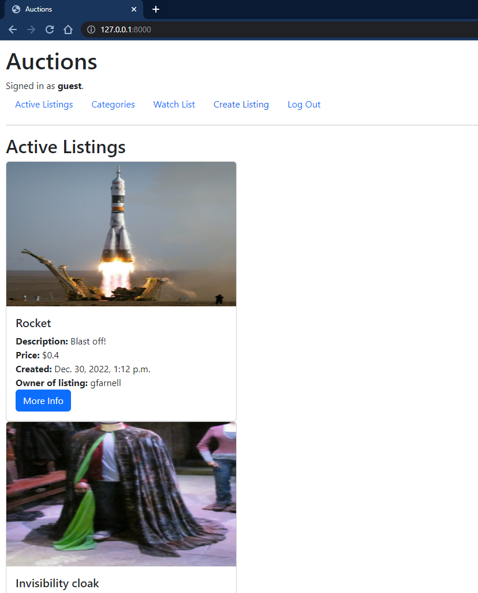

# e-Commerce website using Django framework and Python

This simple app is an eBay-like e-commerce auction site that will allow users to post auction listings, place bids on listings, comment on listings, and add listings to a “watchlist.”

This project is deployed on Heroku (please have patience since the instance is likely sleeping but will wake up after a few seconds): <a href="https://python-django-commerce.herokuapp.com/">https://python-django-commerce.herokuapp.com/</a>

A screencast of the project can be found here: <a href="https://youtu.be/6WfF_JHMtnU">https://youtu.be/6WfF_JHMtnU</a>

A screencast of the project is available on YouTube:

You can log in to the Heroku app above with this account that is already entered by default. No registration is required (although you can register):

* username: **guest**
* password: **123**

Some of the technologies I used when building this demo application:

* Visual Studio Code
* Django web framework
* Python
* Git
* HTML
* CSS
* Heroku hosting

-----------
## Project overview

* **Models**: Application contains more than three models in addition to the User model: one for auction listings, one for bids, and one for comments made on auction listings.  See the **models.py** file for more information.

* **Create Listing**: Users can visit a page to create a new listing. They should be able to specify a title for the listing, a text-based description, and what the starting bid should be. Users can also optionally be able to provide a URL for an image for the listing and/or a category (e.g. Fashion, Toys, Electronics, Home, etc.).

* **Active Listings Page**: The default route of the web application lets users view all of the currently active auction listings. For each active listing, this page displays (at minimum) the title, description, current price, and photo (if one exists for the listing).

* **Listing Page**: Clicking on a listing takes users to a page specific to that listing. On that page, users can view all details about the listing, including the current price for the listing.
    * If the user is signed in, the user should be able to add the item to their “Watchlist.” If the item is already on the watchlist, the user should be able to remove it.
    * If the user is signed in, the user should be able to bid on the item. The bid must be at least as large as the starting bid, and must be greater than any other bids that have been placed (if any). If the bid doesn’t meet those criteria, the user should be presented with an error.
    * If the user is signed in and is the one who created the listing, the user can “close” the auction from this page, which makes the highest bidder the winner of the auction and makes the listing no longer active.
    * If a user is signed in on a closed listing page, and the user has won that auction, the page should say so.
    * Users who are signed in can add comments to the listing page. The listing page displays all comments that have been made on the listing.
* **Watchlist**: Users who are signed in can visit a Watchlist page which displays all of the listings that a user has added to their watchlist. Clicking on any of those listings takes the user to that listing’s page.
* **Categories**: Users can visit a page that displays a list of all listing categories. Clicking on the name of any category takes the user to a page that displays all of the active listings in that category.
* **Django Admin Interface**: Via the Django admin interface, as a site administrator you can view, add, edit, and delete any listings, comments, and bids made on the site.

## Screen capture of the application:
